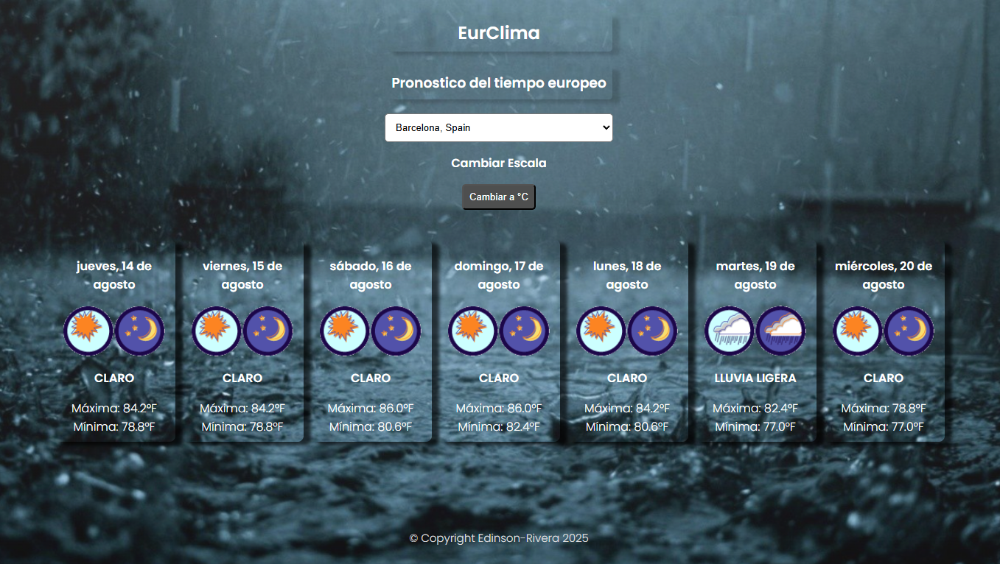

# EurClima 🌤️

**Pronóstico del tiempo europeo**

EurClima es una aplicación web que proporciona pronósticos meteorológicos de 7 días para ciudades europeas, con una interfaz intuitiva y diseño responsivo.



## ✨ Características

- 📍 **Selección de ciudades europeas** desde un menú desplegable
- 🌡️ **Conversión de temperatura** entre Celsius y Fahrenheit
- 📅 **Pronóstico de 7 días** con información detallada
- 🌦️ **Iconos del clima** representativos para cada condición
- 📱 **Diseño responsivo** que se adapta a cualquier dispositivo
- ⚡ **Carga dinámica** con indicador visual

## 🛠️ Tecnologías Utilizadas

- **HTML5** - Estructura semántica
- **CSS3** - Estilos y diseño responsivo
- **JavaScript ES6+** - Lógica de la aplicación
- **7Timer API** - Servicio de datos meteorológicos
- **Google Fonts** - Tipografía Poppins

## 📁 Estructura del Proyecto

```
eurclima/
├── index.html              # Página principal
├── js/
│   └── main.js             # Lógica principal de la aplicación
├── css/
│   └── master.css          # Estilos de la aplicación
├── images/                 # Iconos del clima y recursos
│   ├── clear.png
│   ├── cloudy.png
│   ├── pcloudy.png
│   ├── rain.png
│   └── load-36_256.gif     # Indicador de carga
└── city_coordinates.csv    # Base de datos de ciudades
```

## 🚀 Instalación y Uso

### Prerrequisitos

- Navegador web moderno
- Servidor web local (recomendado para evitar problemas de CORS)

### Pasos de instalación

1. **Clona o descarga el proyecto**
   ```bash
   git clone https://github.com/EdinsonR7/Clima-Europa.git
   cd eurclima
   ```

2. **Prepara el archivo de ciudades**
   - Crea el archivo `city_coordinates.csv` en la raíz del proyecto
   - Formato: `latitud,longitud,nombre_ciudad,país`
   - Ejemplo:
   ```csv
   lat,lon,city,country
   48.8566,2.3522,París,Francia
   41.9028,12.4964,Roma,Italia
   52.5200,13.4050,Berlín,Alemania
   ```

3. **Inicia un servidor web local**
   ```bash
   localhost:5500 en el navegador utilizando en VS Live Server
   ```

4. **Abre la aplicación**
   - Navega a `http://localhost:5500/`
   - Selecciona una ciudad del menú desplegable
   - ¡Disfruta del pronóstico!

## 🎯 Funcionalidades Principales

### Selección de Ciudad
- Carga automática de ciudades desde archivo CSV
- Ordenamiento alfabético de las opciones
- Búsqueda por nombre de ciudad y país

### Visualización del Clima
- **Información mostrada por día:**
  - Fecha formateada en español
  - Icono representativo del clima
  - Descripción del estado del tiempo
  - Temperatura máxima y mínima
  - Unidad de medida selectable

### Conversión de Temperatura
- Alternar entre Celsius (°C) y Fahrenheit (°F)
- Conversión automática de todos los valores mostrados
- Botón dinámico que indica la escala actual

## 🌦️ Estados del Clima Soportados

| Código API | Descripción | Icono |
|------------|-------------|--------|
| clear | Claro | ☀️ |
| pcloudy | Parcialmente nublado | ⛅ |
| mcloudy | Nublado | ☁️ |
| cloudy | Muy nublado | ☁️ |
| humid | Húmedo | 🌫️ |
| lightrain | Lluvia ligera | 🌦️ |
| oshower | Chubascos | 🌧️ |
| rain | Lluvioso | 🌧️ |
| ts | Tormenta | ⛈️ |

## ⚙️ API Utilizada

**7Timer API** - Servicio meteorológico gratuito
- **Endpoint:** `https://www.7timer.info/bin/api.pl`
- **Producto:** `civillight` (pronóstico civil simplificado)
- **Formato:** JSON
- **Cobertura:** Mundial con alta precisión en Europa

## 🎨 Personalización

### Estilos CSS
El archivo `master.css` utiliza:
- **Flexbox** para layouts responsivos
- **Google Fonts** (Poppins) para tipografía moderna
- **Gradientes** y **sombras** para efectos visuales
- **Variables CSS** fácilmente personalizables

### Agregar Nuevas Ciudades
1. Edita el archivo `city_coordinates.csv`
2. Agrega líneas con formato: `latitud,longitud,nombre,país`
3. Recarga la aplicación

## 🔧 Solución de Problemas

### Errores Comunes

**Error al cargar CSV**
- Verifica que `city_coordinates.csv` esté en la raíz
- Asegúrate de usar un servidor web local
- Revisa el formato del archivo CSV

**No aparecen datos del clima**
- Verifica tu conexión a internet
- Confirma que las coordenadas sean válidas
- La API puede tener límites de uso

**Iconos no se muestran**
- Verifica que la carpeta `images/` contenga los archivos
- Revisa las rutas de los iconos en `main.js`

## 📱 Compatibilidad

- ✅ Chrome 60+
- ✅ Firefox 55+
- ✅ Safari 12+
- ✅ Edge 79+
- ✅ Dispositivos móviles (iOS/Android)

## 🤝 Contribuciones

Las contribuciones son bienvenidas. Para contribuir:

1. Haz fork del proyecto
2. Crea una rama para tu función (`git checkout -b feature/nueva-funcion`)
3. Haz commit de tus cambios (`git commit -m 'Agregar nueva función'`)
4. Haz push a la rama (`git push origin feature/nueva-funcion`)
5. Abre un Pull Request

## 📄 Licencia

© Copyright Edinson-Rivera 2025

## 🆘 Soporte

Para reportar bugs o solicitar funciones:
- Abre un issue en el repositorio
- Incluye pasos para reproducir el problema
- Especifica tu navegador y sistema operativo

## 🔮 Funciones Futuras

- [ ] Geolocalización automática
- [ ] Pronóstico horario
- [ ] Gráficos de temperatura
- [ ] Notificaciones push
- [ ] Modo oscuro/claro
- [ ] Múltiples idiomas
- [ ] Mapas interactivos

---

**Desarrollado por Edinson-Rivera**
